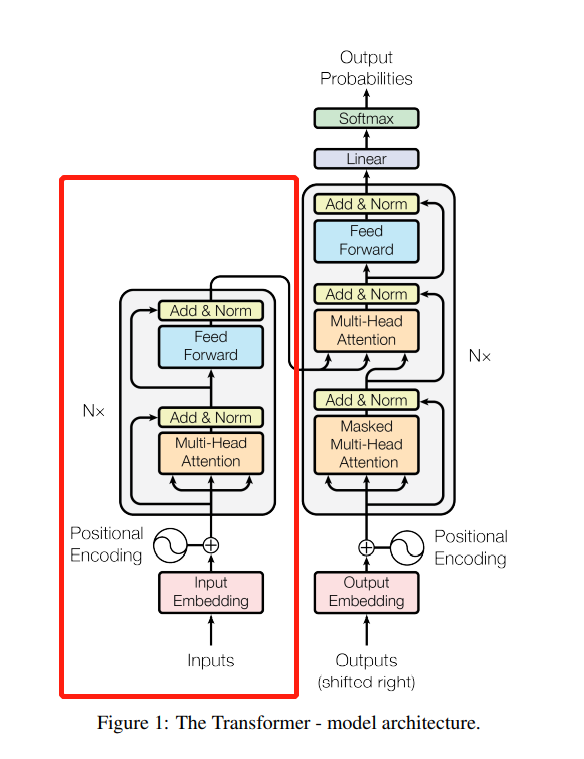

本篇主要内容是wenet模型的代码笔记、工程向的阅读笔记

# 1.* 数据采集

# 2.* 数据处理

# 3.训练train

wenet toolkit进行训练流程时，需为train.py使用时配置"--config xxx.yaml"，可以选择transformer、conformer等不同的模型结构。
本片笔记以transformer为例，记录解读wenet toolkit的训练流程。


## 3.1 train代码outside

### 模型第一层：
模型层级：train.py--->asr_model.py--->encoder.py--->encoder_lyayer.py--->attention.py
asr_model.py、encoder.py、encoder_lyayer.py、attention.py的__init__函数，负责初始化模型类；forward函数，负责控制数据流向、计算。
### 模型第二层：
下面代码是asr_model.py的init_asr_model()函数，wenet模型主要由3大块组成，encoder(ConformerEncoder/TransformerEncoder)、decoder(TransformerDecoder/BiTransformerDecoder)、ctc：
```
    ctc = CTC(vocab_size, encoder.output_size())
    model = ASRModel(
        vocab_size=vocab_size,
        encoder=encoder,
        decoder=decoder,
        ctc=ctc,
        **configs['model_conf'],
    )
```
### 模型第三层：
下面代码是encoder.py的TransformerEncoder类的init函数()，wenet的encoder结构，首先是modulelist里面包裹结构一致的transformerencoderlayer,称为一个block。
一个transformerencoderlayer由3大块组成，MultiHeadedAttention、PositionwiseFeedForward。
如果选择Conformerencoderlayer,而不是Transformerencoderlayer，那么layer中的子块可以从MultiHeadedAttention、RelPositionMultiHeadedAttention二者择其一。
```
        self.encoders = torch.nn.ModuleList([
            TransformerEncoderLayer(
                output_size,
                MultiHeadedAttention(attention_heads, output_size,
                                     attention_dropout_rate),
                PositionwiseFeedForward(output_size, linear_units,
                                        dropout_rate), dropout_rate,
                normalize_before, concat_after) for _ in range(num_blocks)
        ])
```

### 模型第四层：
transformer的实际计算过程。encoder_lyayer.py
*补图片
*补计算过程


### 模型第五层：
attention的实际计算过程。attention.py
*补图片
*补计算过程

PositionwiseFeedForward，解释一下


multiple-attention的计算&代码实现

transformer

attention&RNN/LSTM的比较

混合精度mixed precision training、多卡训练ddp、自动混合精度amp


# 4.识别recognize

# 5.模型抽取jit

# 6.部署deploy
